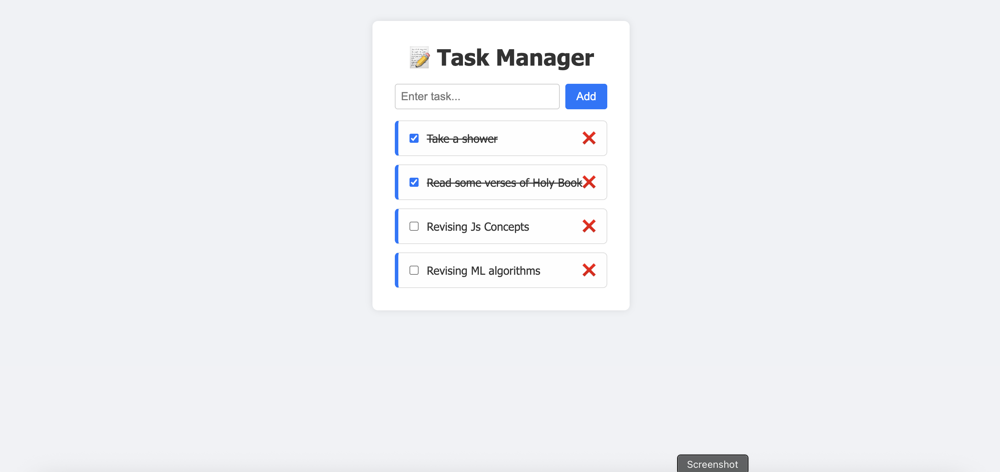

# ✅ Task Manager - React App

A clean, responsive, and animated **Task Manager** web application built using **React JS**, **Vite**, **CSS Modules**, and **Framer Motion**. It allows users to add, complete, and delete tasks — with smooth animations and device-responsive UI (mobile, tablet, and desktop).

---

## 📸 Preview

## 🔗 Live-link
https://task-manager-beryl-two.vercel.app/

---

## 🚀 Features

- ✅ Add new tasks
- ✅ Mark tasks as complete/incomplete
- ✅ Delete tasks
- ✅ Responsive layout (Mobile / Tablet / Laptop)
- ✅ Modular component-based structure
- ✅ Clean UI with CSS modules + media queries

---

## 🛠 Tech Stack

- ⚛️ React JS (with Vite)
- 🎨 CSS Modules
- 📦 Framer Motion (for animation)
- 📁 Context API (for global state)

---

## 📂 Folder Structure
task-manager/
│
├── public/
│   └── screenshot.png
│
├── src/
│   ├── components/
│   │   ├── TaskForm.jsx
│   │   ├── TaskForm.css ✅
│   │   ├── TaskList.jsx
│   │   ├── TaskList.css ✅
│   │   ├── TaskItem.jsx
│   │   ├── TaskItem.css ✅
│   │
│   ├── context/
│   │   └── TaskContext.jsx
│
│   ├── App.jsx
│   ├── App.css ✅
│   ├── main.jsx
│
├── index.css ✅
├── README.md ✅
├── package.json
├── vite.config.js
